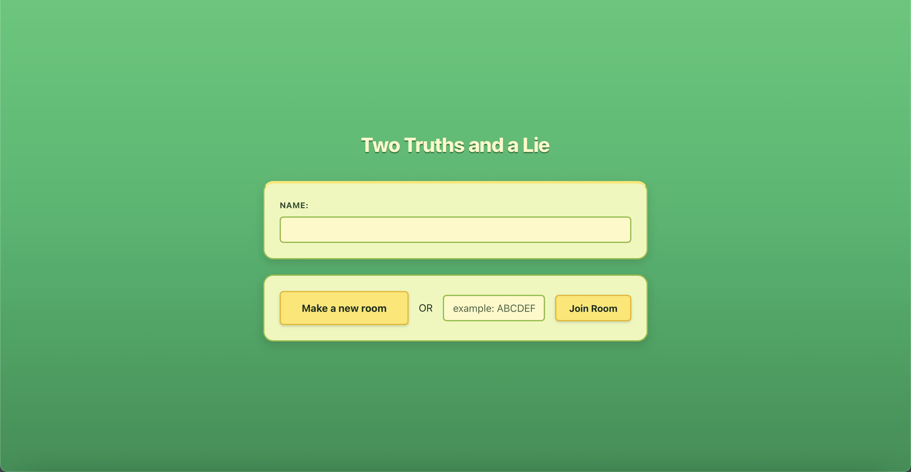
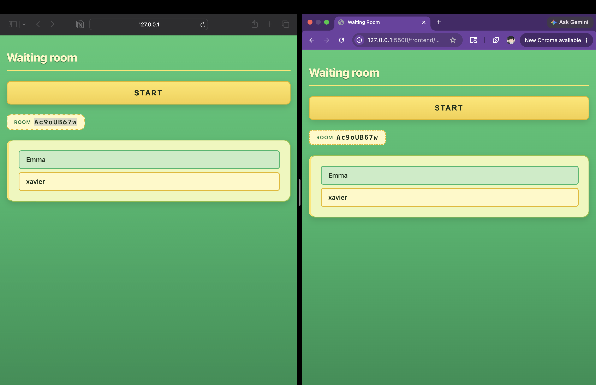
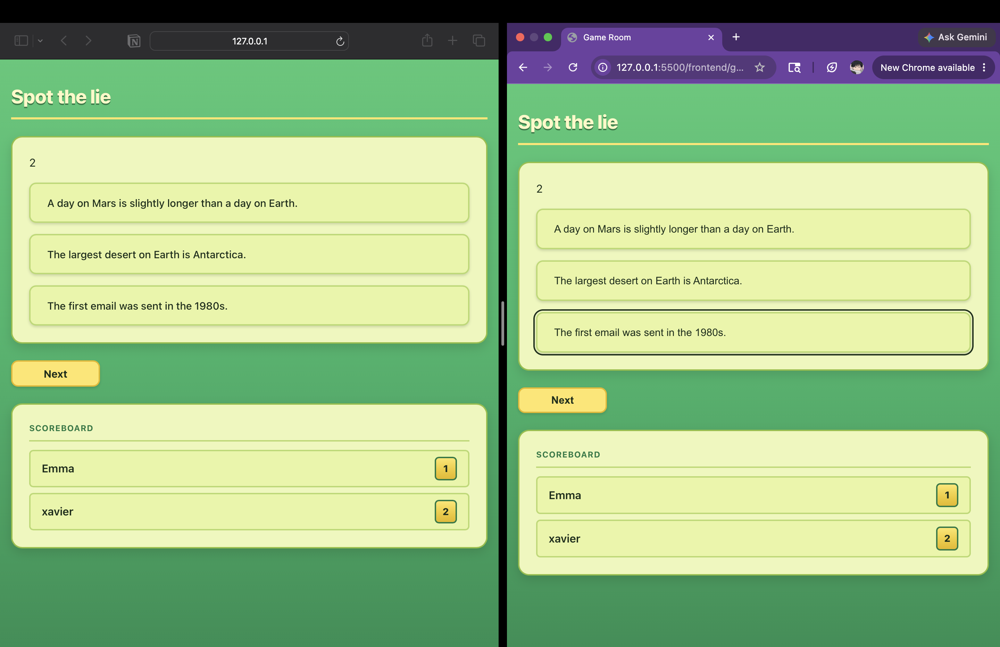

# Two Truths and a Lie

## Description
A real time multiplayer game of the classic two truths and a lie. 
- Real-time multiplayer gameplay using Socket.IO
- Room creation and joining
- Host-controlled game flow
- Automatic reconnection handling
- Room cleanup and expiry system
- Persistent player identity using localStorage

### Pages 

#### Landing Page 

Consists of a name box for the user to enter their name in and an option to either create a new instance of a room or a join an existing one. PlayerId(generated by server) and name are saved onto local storage. 

#### Waiting Room 

First an authentication is run. 
AUTH RULES:
- 1.if room unactive and player not in:give them new id, update db and let them in
- 2.if room inactive and player in: let them in
- 3.if room active and player not in:block them
- 4.if room active and player in:let them in

if authenticated, user is allowed to establish a socket connection and officially enter the waiting room. 

#### Game Room 

First an authentication is run. 
AUTH RULES:
- 1.if room inactive and player not in:block 
- 2.if room inactive and player in:block
- 3.if room active and player not in:block
- 4.if room active and player in: LET THEM ENTER 

and then the game begins 

## Unique Architectural choices critical to the game 
- Reconnection logic in waiting room: If a player accidentally leaves the waiting room due to any reason(example: page refresh), new socket connection is established. On the moment of leaving, player is immediately removed from UI and a count down of permanent removal of their playerId is issued to execute in 30 seconds. If they re join within 30 seconds, the countdown is discarded and things continue smoothly. 
If the player happened to be a host, everyone gets a warning that if the host doesn't rejoin in 30 seconds, the room will be deleted. 

- Reconnection logic in game room: If a player accidentally leaves the game room due to any reason(example: page refresh), new socket connection is established. On the moment of leaving, player is kept UI.If the player happened to be a host, everyone gets a warning that if the host doesn't rejoin in 30 seconds, the room will be deleted. 

- Host Controls: Starting the game, moving onto the next question, are all powers that lie with the host. 

- Room Clean Up: When a room is created, it is given a life period of twenty minutes(reasonable for a 5 question game). If the game ends successfully(not abandoned), the room is deleted sixty seconds from ending. 

## Tech Stack
- Node.js
- Express
- Socket.IO
- MongoDB

## Installation
npm install express 
npm install mongodb 
npm install cors 
npm install socket.io
node index 